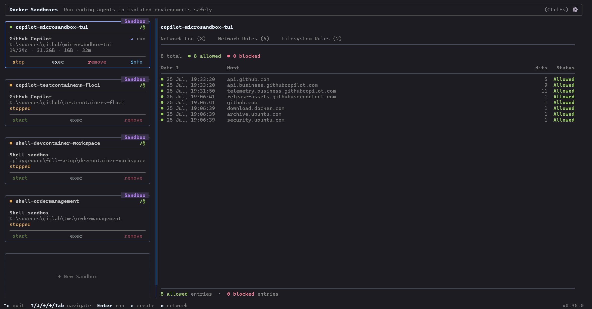

# microsandbox-tui

A terminal user interface for managing [MicroSandboxes](https://microsandbox.dev/) —
lightweight microVM sandboxes — built with [ratatui](https://ratatui.rs/) and the
official [microsandbox Rust SDK](https://crates.io/crates/microsandbox).



## Features

- **Sandbox list** — colour-coded status cards (🟢 running · 🟡 stopped · 🔴 crashed)
  with image, CPU/memory config, and age
- **Lifecycle management** — create, start, stop, kill, and remove sandboxes from the
  keyboard
- **Logs tab** — scrollable, colour-coded log output by source (stdout / stderr / pty /
  system)
- **Metrics tab** — live CPU and memory gauges, disk I/O counters, network rx/tx, uptime
- **Filesystem tab** — browse the sandbox filesystem; navigate into directories with
  `Enter`, go up with `Backspace`
- **Info tab** — full sandbox configuration (image, CPUs, memory, timestamps)
- **Create dialog** — modal form with validation for creating new sandboxes
- **Auto-refresh** — sandbox list and detail data refresh automatically every 3 seconds

## Keyboard Shortcuts

| Key | Action |
|-----|--------|
| `q` / `Ctrl-c` | Quit |
| `↑` / `k` | Move up in list / scroll up in detail |
| `↓` / `j` | Move down in list / scroll down in detail |
| `Tab` | Switch focus between list and detail panel |
| `←` / `h` | Previous detail tab |
| `→` / `l` | Next detail tab |
| `n` / `Enter` | Open "New Sandbox" dialog |
| `s` | Start selected sandbox |
| `S` | Stop selected sandbox |
| `K` | Kill selected sandbox (SIGKILL) |
| `d` | Remove selected sandbox |
| `r` | Force refresh |
| `Backspace` | Navigate up one directory (Filesystem tab) |
| `Esc` | Close dialog |

## Installation

### Prerequisites

- Rust 1.75 or later — install via [rustup](https://rustup.rs/)
- A running microsandbox server (`micsb server start`)
- **Linux only** — requires `libcap-ng`:
  ```bash
  sudo apt install libcap-ng-dev    # Debian / Ubuntu
  sudo dnf install libcap-ng-devel  # Fedora / RHEL
  ```

### Build from source

```bash
git clone https://github.com/cfranzen/microsandbox-tui
cd microsandbox-tui
cargo build --release
./target/release/microsandbox-tui
```

## Usage

Start a microsandbox server first, then launch the TUI:

```bash
# Start the microsandbox server (once)
micsb server start

# Launch the TUI
microsandbox-tui
```

The TUI connects to the local microsandbox server automatically.

## Project Structure

```
src/
├── main.rs             # Terminal setup/teardown, entry point
├── app.rs              # Application state, event loop, input handling
├── sandbox/
│   └── mod.rs          # Async SDK wrappers (list, create, start, stop, …)
└── ui/
    ├── mod.rs           # Top-level render dispatcher
    ├── layout.rs        # Header / footer / two-column split
    ├── sandbox_list.rs  # Left panel: sandbox cards
    ├── detail.rs        # Right panel: tab bar
    ├── logs.rs          # Logs tab
    ├── metrics.rs       # Metrics tab
    ├── filesystem.rs    # Filesystem tab
    ├── info.rs          # Info tab
    └── create_dialog.rs # New sandbox modal
```

## Contributing

Contributions are welcome! Please read [CONTRIBUTING.md](CONTRIBUTING.md) first.

## License

MIT — see [LICENSE](LICENSE).
